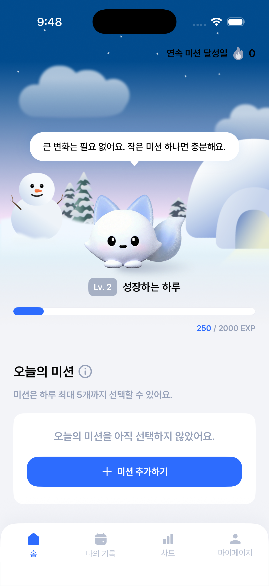
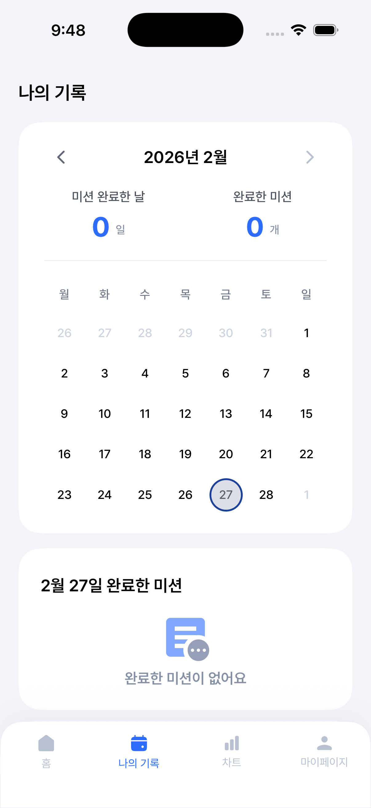
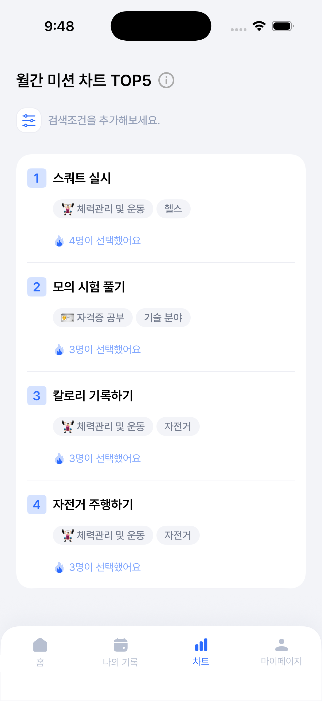
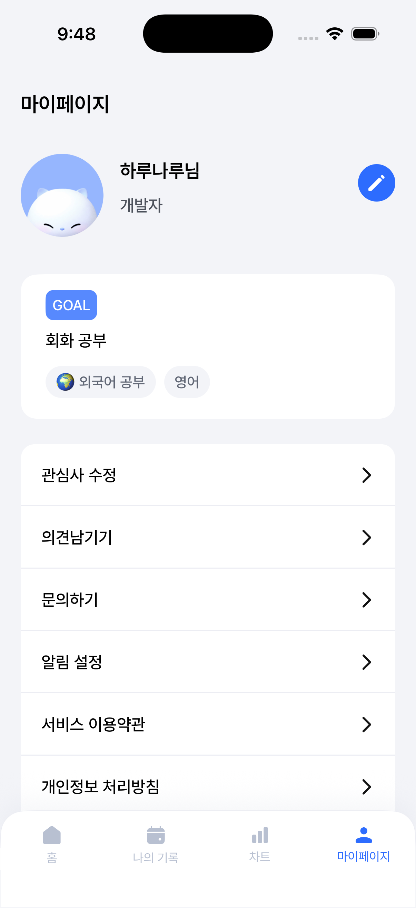

# HaruUp

<p align="center">
  
  
  
  
</p>

> **AI 기반 맞춤형 자기계발 챌린지 서비스**

AI가 유저의 관심사와 목표를 기반으로 일일 미션을 추천하고, 유저는 이를 수행하며 유저와 가상 캐릭터가 함께 성장하는 “챌린지형 서비스"입니다.

---

## 📸 스크린샷

| 홈 | 기록 | 차트 | 마이페이지 |
|:--:|:--:|:--:|:--:|
|  |  |  |  |

---

## ✨ 주요 기능

- 🔐 **소셜 로그인** — 카카오톡, 네이버, 애플 계정으로 간편 로그인
- 🎯 **큐레이션 기반 미션 추천** — 직업·관심사·목표에 맞춤화된 일일 미션 제공
- ✅ **미션 관리** — 오늘의 미션 선택·완료·기록
- 📅 **달성 기록** — 캘린더 기반 미션 달성 히스토리 확인
- 📊 **순위 차트** — 다른 사용자와 미션 달성 현황 비교
- 🔔 **푸시 알림** — FCM 기반 미션 리마인드 알림 및 맞춤 설정

---

## 🗺️ 화면 구성

```
앱 실행
  └─ 스플래시

로그인 미완료
  └─ 로그인 (카카오 / 네이버)
       └─ 약관 동의
            └─ 온보딩
                 └─ 큐레이션 (초기 설정 9단계)
                      ├─ 닉네임 입력
                      ├─ 생일 선택
                      ├─ 성별 선택
                      ├─ 직업 선택 → 직업 상세 선택
                      ├─ 관심사 선택 → 관심사 상세 선택
                      └─ 목표 선택 → 목표 직접 입력
                           └─ 로딩 → 로딩 완료

로그인 완료
  └─ 메인 탭
       ├─ 🏠 홈       — 오늘의 미션 관리
       ├─ 📅 기록     — 미션 달성 캘린더
       ├─ 📊 차트     — 미션 달성 순위
       └─ 👤 마이페이지 — 프로필·관심사·알림 설정
```

---

## 🛠 기술 스택

| 구분 | 내용 |
|------|------|
| **언어** | Swift 5.0 |
| **최소 배포 버전** | iOS 16.4 |
| **아키텍처** | MVVM-C (Model-View-ViewModel-Coordinator) |
| **반응형 프로그래밍** | RxSwift, RxCocoa |
| **네트워킹** | Alamofire |
| **소셜 로그인** | KakaoSDK, Naver ThirdPartyLogin |
| **푸시 알림** | Firebase Cloud Messaging (FCM) |
| **애니메이션** | Lottie |
| **분석** | Amplitude |
| **로컬 저장소** | UserDefaults, Keychain, Core Data |
| **패키지 관리** | Swift Package Manager (SPM) |

---

## 🏗 아키텍처

MVVM-C (Model-View-ViewModel-Coordinator) 패턴을 적용했습니다.

```
┌─────────────────────────────────┐
│   View (ViewController)         │  UI 렌더링, 사용자 이벤트 처리
└───────────────┬─────────────────┘
                │ RxSwift 바인딩 (Input/Output)
┌───────────────▼─────────────────┐
│   ViewModel                     │  비즈니스 로직, 상태 관리
└───────────────┬─────────────────┘
                │ Dependency Injection
┌───────────────▼─────────────────┐
│   Service Layer                 │  네트워크 / 로컬 데이터 처리
└─────────────────────────────────┘

Coordinator: 화면 전환 및 의존성 주입 전담
```

### 디렉토리 구조

```
HaruUp/
├── Application/          # AppDelegate, SceneDelegate
├── Presentation/         # View, ViewModel, Coordinator (화면별)
│   ├── Base/             # AppCoordinator
│   ├── Splash/
│   ├── LoginScreen/
│   ├── Curation/         # 초기 설정 9단계
│   ├── Home/
│   ├── History/
│   ├── Chart/
│   └── MyPage/
├── Data/
│   ├── Models/           # 데이터 모델 (Codable)
│   └── UserDefaults/     # 로컬 설정 저장
├── Network/
│   ├── Base/
│   ├── Service/          # MissionService, MemberService 등
│   └── APIClient.swift
├── Component/            # 재사용 UI 컴포넌트
├── Utils/                # Extensions, DateHelper, Keychain 등
└── Resources/            # Assets, Fonts, Lottie, CoreData
```

---

## 📦 의존성 (Swift Package Manager)

| 라이브러리 | 용도 |
|-----------|------|
| [RxSwift](https://github.com/ReactiveX/RxSwift) | 반응형 프로그래밍 |
| [RxCocoa](https://github.com/ReactiveX/RxSwift) | UIKit RxSwift 바인딩 |
| [Alamofire](https://github.com/Alamofire/Alamofire) | HTTP 네트워킹 |
| [KakaoSDK](https://github.com/kakao/kakao-ios-sdk) | 카카오 소셜 로그인 |
| [Naver ThirdPartyLogin](https://github.com/naver/naveridlogin-sdk-ios) | 네이버 소셜 로그인 |
| [Firebase (Core, Messaging)](https://github.com/firebase/firebase-ios-sdk) | 앱 인프라 및 FCM 푸시 알림 |
| [Lottie](https://github.com/airbnb/lottie-ios) | JSON 기반 애니메이션 |
| [AmplitudeSwift](https://github.com/amplitude/Amplitude-Swift) | 사용자 행동 분석 |

---

## 🚀 시작하기

### 요구 사항

- Xcode 16.0 이상
- iOS 16.4 이상 시뮬레이터 또는 실기기
- Apple Developer 계정 (푸시 알림 테스트 시 실기기 필요)

### 설치 및 실행

```bash
# 1. 저장소 클론
git clone https://github.com/your-org/HaruUp.git
cd HaruUp

# 2. Xcode에서 프로젝트 열기
open HaruUp.xcodeproj
```

Xcode가 열리면 SPM 패키지가 자동으로 다운로드됩니다.

### API 키 설정

> ⚠️ 보안상 API 키는 저장소에 포함되지 않습니다.
> 아래 파일들을 별도로 추가해야 합니다.

| 파일 | 설명 |
|------|------|
| `HaruUp/GoogleService-Info.plist` | Firebase 설정 파일 |
| `HaruUp/Application/Info.plist` → `KAKAO_NATIVE_APP_KEY` | 카카오 네이티브 앱 키 |
| `HaruUp/Application/Info.plist` → `AMPLITUDE_API_KEY` | Amplitude API 키 |

---

## 📄 라이선스

이 프로젝트는 SWYP 팀의 소유입니다.
